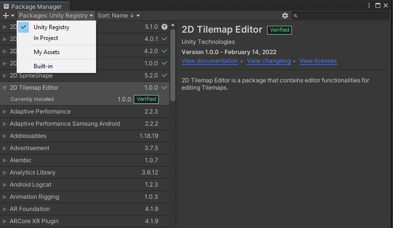
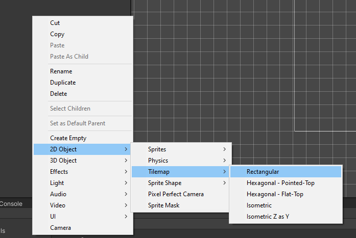
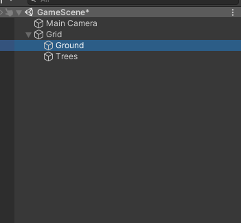
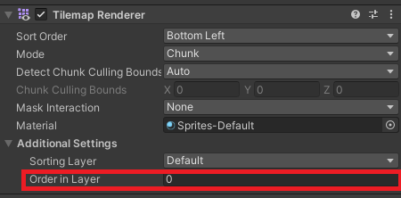
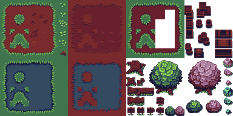
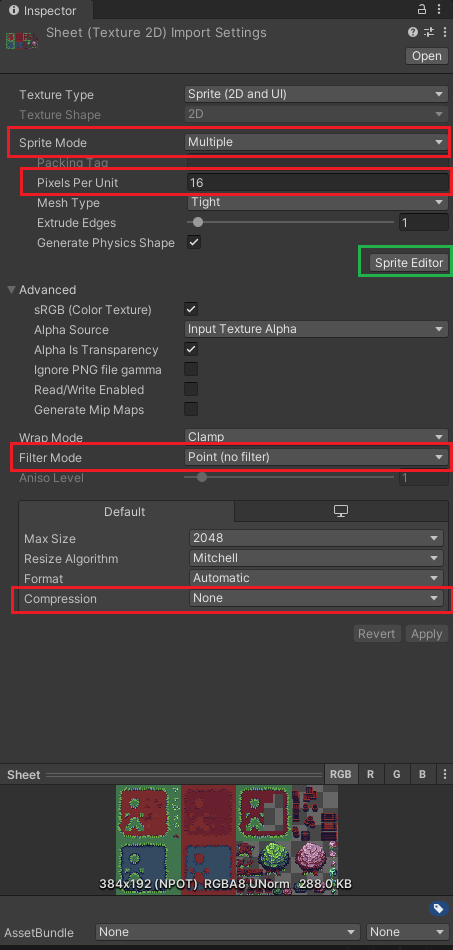
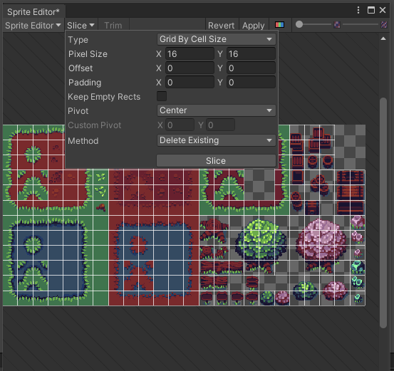
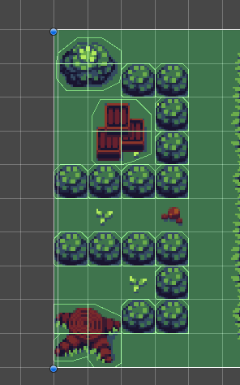
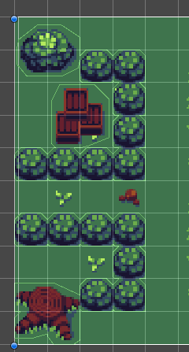

# Tilemap

Learning how to create tilemaps in Unity

## Tilemap Package

You need to have `Tilemap` package installed in your project to use Tilemap

When creating a 2D project from Unity Hub, the Tilemap package is already installed. But you can always install it via the `Package Manager`.

To install from Package Manager select `Window` -> `Package Manager` -> `Packages: Unity Registry` -> `2D Tilemap Editor`

## Create Tilemap

Right click on `Hierarchy` panel -> `2D Object` -> `Tilemap` -> `Rectangular` to create tilemaps

When you finish that, a `Grid` will be created and store your `TileMap` object

`Grid` is used to store multiple tilemaps. You will need many tilemaps in your game. For example, the `Ground` tilemap stores ground tiles (your character can walk on without collision), `Tree` tilemap stores trees with collision

You can change render order of tilemaps in `Tilemap Renderer` component: `Additional Settings` -> `Order in layer`. Tilemap with lower order will be rendered behind other tilemap (`Ground` Should has `-1` order)

## Setup your tilemap

You need a tilemap sprite to draw tiles.

First, import your tilemap sprite into your project. A tilemap sprite looks like this:

Then, your sprite property in `Inspector`
- `Sprite mode`: `Multiple` - Multiple tiles in this sprite
- `Pixels Per Unit`: Size of a tile (Ex. a tile with 16x16 size, you need to set this number to 16)
- `Filter mode`: Point (no filter) - For better image quality
- `Compression`: None - For better image quality

Then, slice your sprite:
- Click `Sprite Editor`
- Select `Slice`
- Select `Type`: `Grid By Cell Size`
- Change `Pixel Size` to your tile size (Ex. 16x16)
- Hit `Slice`
- Hit `Apply` 

Then import your sprite into `Tile Palette` to edit/draw:
- Open `Tile Palette` window by select `Window` -> `2D` -> `Tile Palette`.
- Hit `Create New Palette` -> Give it a name -> Save to `Palettes` folder
- Drag and drop your sprite into `Tile Palette` (Save to `Tiles` folder)

## Edit tilemap

In `Tile Palette`, you can use `Alt + Left Mouse` to move around.

Hit `Edit` in `Tile Palette` to start editing your tilemap. You can:
- Revert your change by `Ctrl + Z`
- Remove tiles using `Erase(D)` tool
- Select tile(s) using `Select(S)` tool and move them around using `Move(M)` tool

When you finish editing, hit `Edit` again to save and exit edit mode.

## Draw tilemaps on your scene

Select `Active TileMap`, make sure you select the tilemap you are working on

Draw with `Brush(B)`:
- Select `Brush(B)` tool
- Choose a tile in `Tile Palette` (or tiles by drag)
- Drag and drop on the scene to draw

Draw with `FilledBox(U)`:
- Select `FilledBox(U)` tool
- Choose a tile in `Tile Palette` (or tiles by drag)
- Drag and drop on the scene to draw

## Add collider to your tilemap

`Ground` tilemap usually has no collider (so character can walk on it)

To add collider to your tilemap:
- Select your tilemap in `Hierarchy`
- Add `Tilemap Collider 2D` component
- Add `Composite Collider` component (it will add a `Rigidbody 2D` component to your tilemap automatically - since it is a physics based)
- Set `Body Type` to `Static` in `Rigidbody 2D` component (otherwise your tiles will drop down by gravity when you enter playmode)
- Check `Used By Composite` in `Tilemap Collider 2D` to tell `Composite Collider` creates colliders only for whose shape, not for single tile -> Better performance

Collider for single tile - Each tile has a collider:

Collider for whose shape - connected tiles will have only one collider:

## References

https://www.youtube.com/watch?v=DTp5zi8_u1U&ab_channel=Velvary